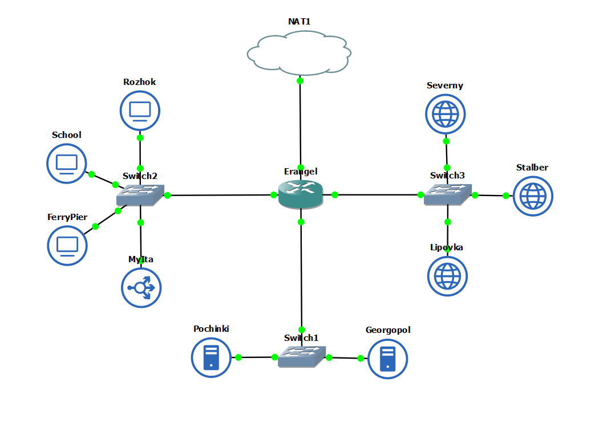

| Nama    | NRP     | 
| ------- | ------- | 
| Imam Nurhadi    | 5027221046     | 
| Jojo     | 5027221062     |

## SOAL 1
Untuk membantu pertempuran di **Erangel**, kamu ditugaskan untuk membuat jaringan komputer yang akan digunakan sebagai alat komunikasi. berikut konfigurasinya :

- DNS Master akan diberi nama **Pochinki**, sesuai dengan kota tempat dibuatnya server tersebut
- Karena ada kemungkinan musuh akan mencoba menyerang Server Utama, maka buatlah DNS Slave **Georgopol** yang mengarah ke Pochinki
- Markas pusat juga meminta dibuatkan tiga Web Server yaitu **Severny, Stalber,** dan **Lipovka**. Sedangkan **Mylta** akan bertindak sebagai Load Balancer untuk server-server tersebut



## Soal 2
Karena para pasukan membutuhkan koordinasi untuk mengambil airdrop, maka buatlah sebuah domain yang mengarah ke Stalber dengan alamat **airdrop.xxxx.com** dengan alias **www.airdrop.xxxx.com** dimana xxxx merupakan kode kelompok. disini kami memakai airdrop.it04.com

```bash
!#/bin/bash
cat <<EOF > /etc/bind/named.conf.local
zone "airdrop.it04.com" {
    type master;
    also-notify { 192.168.1.3; };
    allow-transfer { 192.168.1.3; };
    file "/etc/bind/zone/airdrop.it04.com";
};
EOF
```

```bash
!#/bin/bash
cat <<EOF > /etc/bind/zone/airdrop.it04.com
\$TTL    604800
@       IN      SOA     airdrop.it04.com. root.airdrop.it04.com. (
                              2         ; Serial
                         604800         ; Refresh
                          86400         ; Retry
                        2419200         ; Expire
                         604800 )       ; Negative Cache TTL
;
@       IN      NS      airdrop.it04.com.
@       IN      A       192.168.3.3
@       IN      AAAA    ::1
www     IN      CNAME   airdrop.it04.com.
medkit  IN      A       192.168.3.4
EOF
```

## Soal 3
Para pasukan juga perlu mengetahui mana titik yang sedang di bombardir artileri, sehingga dibutuhkan domain lain yaitu **redzone.xxxx.com** dengan alias **www.redzone.xxxx.com** yang mengarah ke Severny

```bash
!#/bin/bash
cat <<EOF > /etc/bind/named.conf.local
zone "redzone.it04.com" {
    type master;
    also-notify { 192.168.1.3; };
    allow-transfer { 192.168.1.3; }; 
    file "/etc/bind/zone/redzone.it04.com";
};
EOF
```

```bash
!#/bin/bash
cat <<EOF > /etc/bind/zone/redzone.it04.com
\$TTL    604800
@       IN      SOA     redzone.it04.com. root.redzone.it04.com. (
                              2         ; Serial
                         604800         ; Refresh
                          86400         ; Retry
                        2419200         ; Expire
                         604800 )       ; Negative Cache TTL
;
@       IN      NS      redzone.it04.com.
@       IN      A       192.168.3.2
@       IN      AAAA    ::1
www     IN      CNAME   redzone.it04.com.
ns1     IN      A       192.168.1.3
siren   IN      NS      ns1
EOF
```

# Soal 4
Markas pusat meminta dibuatnya domain khusus untuk menaruh informasi persenjataan dan suplai yang tersebar. Informasi persenjataan dan suplai tersebut mengarah ke Mylta dan domain yang ingin digunakan adalah **loot.xxxx.com** dengan alias **www.loot.xxxx.com**

```bash
!#/bin/bashv
cat <<EOF > /etc/bind/named.conf.local
zone "loot.it04.com" {
    type master;
    file "/etc/bind/zone/loot.it04.com";
};
EOF
```

```bash
!#/bin/bash
cat <<EOF > /etc/bind/zone/loot.it04.com
\$TTL    604800
@       IN      SOA     loot.it04.com. root.loot.it04.com. (
                              2         ; Serial
                         604800         ; Refresh
                          86400         ; Retry
                        2419200         ; Expire
                         604800 )       ; Negative Cache TTL
;
@       IN      NS      loot.it04.com.
@       IN      A       192.168.2.5
@       IN      AAAA    ::1
www     IN      CNAME   loot.it04.com.
EOF
```

# Soal 5
Pastikan domain-domain tersebut dapat diakses oleh seluruh komputer (client) yang berada di Erangel

- Rozhok
    
    
    
- School
    
    
    
- FerryPier
    
    
    
# Soal 6
Beberapa daerah memiliki keterbatasan yang menyebabkan **hanya dapat** mengakses domain secara langsung melalui **alamat IP** domain tersebut. Karena daerah tersebut tidak diketahui secara spesifik, pastikan semua komputer (client) dapat mengakses domain **redzone.xxxx.com** melalui **alamat IP** Severny (Notes : menggunakan pointer record)


# Soal 7
Akhir-akhir ini seringkali terjadi serangan siber ke DNS Server Utama, sebagai tindakan antisipasi kamu diperintahkan untuk membuat DNS Slave di Georgopol untuk **semua domain** yang sudah dibuat sebelumnya

```bash
!#/bin/bash
cat <<EOF > /etc/bind/named.conf.local
zone "airdrop.it04.com" {
    type slave;
    masters { 192.168.1.2; };
    file "/etc/bind/zone/airdrop.it04.com";
};

zone "redzone.it04.com" {
    type slave;
    masters { 192.168.1.2; };
    file "/etc/bind/zone/redzone.it04.com";
};

zone "3.168.192.in-addr.arpa" {
    type slave;
    masters { 192.168.1.2; };
    file "/etc/bind/zone/3.168.192.in-addr.arpa";
};

zone "loot.it04.com" {
    type slave;
    masters { 192.168.1.2; };
    file "/etc/bind/delegasizone/loot.it04.com";
};
EOF
```

# Soal 8
Kamu juga diperintahkan untuk membuat subdomain khusus melacak airdrop berisi peralatan medis dengan subdomain **medkit.airdrop.xxxx.com** yang mengarah ke Lipovka

```bash
cat <<EOF > /etc/bind/zone/airdrop.it04.com
\$TTL    604800
@       IN      SOA     airdrop.it04.com. root.airdrop.it04.com. (
                              2         ; Serial
                         604800         ; Refresh
                          86400         ; Retry
                        2419200         ; Expire
                         604800 )       ; Negative Cache TTL
;
@       IN      NS      airdrop.it04.com.
@       IN      A       192.168.3.3
@       IN      AAAA    ::1
www     IN      CNAME   airdrop.it04.com.
medkit  IN      A       192.168.3.4
EOF
```

# Soal 9
Terkadang red zone yang pada umumnya di bombardir artileri akan dijatuhi bom oleh pesawat tempur. Untuk melindungi warga, kita diperlukan untuk membuat sistem peringatan air raid dan memasukkannya ke subdomain **siren.redzone.xxxx.com** dalam folder siren ****dan pastikan dapat diakses secara mudah dengan menambahkan alias **www.siren.redzone.xxxx.com** dan mendelegasikan subdomain tersebut ke Georgopol dengan alamat IP menuju radar di Severny

```bash
cat <<EOF > /etc/bind/named.conf.local
zone "siren.redzone.it04.com" {
    type master;
    file "/etc/bind/delegasizone/siren.redzone.it04.com";
};

zone "log.siren.redzone.it04.com" {
    type master;
    file "/etc/bind/delegasizone/log.siren.redzone.it04.com";
};
EOF
```

```bash
cat <<EOF > /etc/bind/delegasizone/siren.redzone.it04.com
\$TTL    604800
@       IN      SOA     siren.redzone.it04.com. root.siren.redzone.it04.com. (
                              2         ; Serial
                         604800         ; Refresh
                          86400         ; Retry
                        2419200         ; Expire
                         604800 )       ; Negative Cache TTL
;
@       IN      NS      siren.redzone.it04.com.
@       IN      A       192.168.3.2
@       IN      AAAA    ::1
www     IN      CNAME   siren.redzone.it04.com.
ns1     IN      A       192.168.1.3
log     IN      NS      ns1
EOF
```

# Soal 10
Markas juga meminta catatan kapan saja pesawat tempur tersebut menjatuhkan bom, maka buatlah subdomain baru di subdomain siren yaitu **log.siren.redzone.xxxx.com** serta aliasnya **www.log.siren.redzone.xxxx.com** yang juga mengarah ke Severny

```bash
cat <<EOF > /etc/bind/delegasizone/log.siren.redzone.it04.com
\$TTL    604800
@       IN      SOA     log.siren.redzone.it04.com. root.log.siren.redzone.it04.com. (
                              2         ; Serial
                         604800         ; Refresh
                          86400         ; Retry
                        2419200         ; Expire
                         604800 )       ; Negative Cache TTL
;
@       IN      NS      log.siren.redzone.it04.com.
@       IN      A       192.168.3.2
@       IN      AAAA    ::1
www     IN      CNAME   log.siren.redzone.it04.com.
EOF
```

# Soal 11
Setelah pertempuran mereda, warga Erangel dapat kembali mengakses jaringan luar, tetapi **hanya** warga **Pochinki** saja yang dapat mengakses jaringan luar secara **langsung**. Buatlah konfigurasi agar warga Erangel yang berada diluar Pochinki dapat mengakses jaringan luar **melalui** DNS Server **Pochinki**

```bash
cat <<EOF > /etc/bind/named.conf.options
options {
    forwarders {
        192.168.122.1;
    };
    allow-query { any; };
    auth-nxdomain no;
    listen-on-v6 { any; };
};
EOF
```

## SOAL 12
Karena pusat ingin sebuah website yang ingin digunakan untuk memantau kondisi markas lainnya maka deploy lah webiste ini (cek resource yg lb) pada severny menggunakan apache

Melakukan configurasi terhadap file apache default pada direktori ```cd /etc/apache2/sites-available/000-default.conf``` dan memberikan konfigurasinya pada port 8080 sebagai berikut: 

```shell
<VirtualHost *:8080>
        # The ServerName directive sets the request scheme, hostname and port that
        # the server uses to identify itself. This is used when creating
        # redirection URLs. In the context of virtual hosts, the ServerName
        # specifies what hostname must appear in the request's Host: header to
        # match this virtual host. For the default virtual host (this file) this
        # value is not decisive as it is used as a last resort host regardless.
        # However, you must set it for any further virtual host explicitly.

        ServerAdmin webmaster@localhost
        DocumentRoot /var/www/it04

        # Available loglevels: trace8, ..., trace1, debug, info, notice, warn,
        # error, crit, alert, emerg.
        # It is also possible to configure the loglevel for particular
        # modules, e.g.
        #LogLevel info ssl:warn

        ErrorLog ${APACHE_LOG_DIR}/error.log
        CustomLog ${APACHE_LOG_DIR}/access.log combined

        # For most configuration files from conf-available/, which are
        # enabled or disabled at a global level, it is possible to
        # include a line for only one particular virtual host. For example the
        # following line enables the CGI configuration for this host only
        # after it has been globally disabled with "a2disconf".
        Include conf-available/serve-cgi-bin.conf
</VirtualHost>

# vim: syntax=apache ts=4 sw=4 sts=4 sr noet
```
Setelah itu memindahkan file default ke it04.conf dengan ```cp 000-default.conf it04.conf``` dan menjalankan beberapa command 
```
service apache2 reload
service apache2 restart
service apache2 status #untuk mencek apakah sudah running
```
dan mengatur index.php pada direktori /var/wwww/it04/index.php sesuai pada ketentuan soal 
```
<?php
$hostname = gethostname();
$date = date('Y-m-d H:i:s');
$php_version = phpversion();
$username = get_current_user();


echo "Hello World!<br>";
echo "Saya adalah: $username<br>";
echo "Saat ini berada di: $hostname<br>";
echo "Versi PHP yang saya gunakan: $php_version<br>";
echo "Tanggal saat ini: $date<br>";
?>
```

lalu dapat kita test dengan menjalankan ```lynx http://localhost:8080```
dan hasilnya sebagai sebagai berikut 

#### FOTO


## Soal 13
Tapi pusat merasa tidak puas dengan performanya karena traffic yag tinggi maka pusat meminta kita memasang load balancer pada web nya, dengan Severny, Stalber, Lipovka sebagai worker dan Mylta sebagai Load Balancer menggunakan apache sebagai web server nya dan load balancernya

Mencoba melakukan konfigurasi load balancing pada ```nano /etc/apache2/sites-available/000-default.conf``` sebagai berikut 

```shell
<VirtualHost *:80>
        # The ServerName directive sets the request scheme, hostname and port that
        # the server uses to identify itself. This is used when creating
        # redirection URLs. In the context of virtual hosts, the ServerName
        # specifies what hostname must appear in the request's Host: header to
        # match this virtual host. For the default virtual host (this file) this
        # value is not decisive as it is used as a last resort host regardless.
        # However, you must set it for any further virtual host explicitly.


    <Proxy balancer://itbalancer>
        BalancerMember http://192.168.2.2:8080
        BalancerMember http://192.168.2.3:8080
        BalancerMember http://192.168.2.4:8080
        ProxySet lbmethod=byrequests
    </Proxy>

    ProxyPreserveHost On
    ProxyPass / balancer://itbalancer/
    ProxyPassReverse / balancer://itbalancer/


        # Available loglevels: trace8, ..., trace1, debug, info, notice, warn,
        # error, crit, alert, emerg.
        # It is also possible to configure the loglevel for particular
        # modules, e.g.
        #LogLevel info ssl:warn

        ErrorLog ${APACHE_LOG_DIR}/error.log
        CustomLog ${APACHE_LOG_DIR}/access.log combined

        # For most configuration files from conf-available/, which are
        # enabled or disabled at a global level, it is possible to
        # include a line for only one particular virtual host. For example the
        # following line enables the CGI configuration for this host only
        # after it has been globally disabled with "a2disconf".
        # Include conf-available/serve-cgi-bin.conf
</VirtualHost>

# vim: syntax=apache ts=4 sw=4 sts=4 sr noet
ServerName 127.0.1.1.
```

setelah itu menerapkan 
```
a2ensite 000-default.conf
service apache2 reload
service apache2 restart
```
lalu kita jalankan ```lynx http://192.168.2.5/index.php```

### FOTO
### FOTO

## Soal 16
Karena dirasa kurang aman karena masih memakai IP, markas ingin akses ke mylta memakai mylta.xxx.com dengan alias www.mylta.xxx.com (sesuai web server terbaik hasil analisis kalian)

Untuk mengatur akses ke mylta tidak hanya memakai IP saja, maka kita perlu mengatur konfigurasi pada **POCHINKI** sebagai master. Untuk mengonfigurasinya, kita perlu mennambahkan mylta.it04.com pada ```nano /etc/bind/named.conf.local``` sebagai berikut 

```shell
zone "airdrop.it04.com" {
    type master;
    also-notify { 192.168.1.3; };
    allow-transfer { 192.168.1.3; };
    file "/etc/bind/zone/airdrop.it04.com";
};

zone "redzone.it04.com" {
    type master;
    also-notify { 192.168.1.3; };
    allow-transfer { 192.168.1.3; };
    file "/etc/bind/zone/redzone.it04.com";
};

zone "3.168.192.in-addr.arpa" {
    type master;
    file "/etc/bind/zone/3.168.192.in-addr.arpa";
};

zone "loot.it04.com" {
    type master;
    file "/etc/bind/delegasizone/loot.it04.com";
};

zone "mylta.it04.com" {
    type master;
    file "/etc/bind/zone/mylta.it04.com";
};
````
setelah itu, kita perlu meemrubah akes dengan IP menjadi nameservernya dan aliasnya (wwww) pada ```/etc/bind/zone/mylta.it04.com``` seperti berikut :

```shell

$TTL    604800
@       IN      SOA     mylta.it04.com. root.mylta.it04.com. (
                              2         ; Serial
                         604800         ; Refresh
                          86400         ; Retry
                        2419200         ; Expire
                         604800 )       ; Negative Cache TTL
;
@       IN      NS      mylta.it04.com.
@       IN      A       192.168.2.5
@       IN      AAAA    ::1
www     IN      CNAME   mylta.it04.com.

```

lalu kita tinggal menuju **mylta** dan mencoba untuk melakukan ```service apache reload``` dan ```service apache2 restart```
maka kita sudah dapat mengakses mylta menggunakan nameservernya seperti berikut 
```shell

root@Rozhok:~# lynx http://mylta.it04.com/index.php


Exiting via interrupt: 2

root@Rozhok:~# lynx http://www.mylta.it04.com/index.php


Exiting via interrupt: 2
```

### FOTO lynx

### FOTO Konfigurasi

### Foto Akses ke Mylta 


### Soal 17
Agar aman, buatlah konfigurasi agar mylta.xxx.com hanya dapat diakses melalui port 14000 dan 14400.
Untuk mengakses mylta.it04.com dengan port spesifik, kita perlu mengonfigurasikan file .conf pada ```/etc/apache2/sites-available``` yaitu file ```default-14000.conf``` dan ```default-14400`` untuk konfigurasinya sebagai berikut:

```shell
<VirtualHost *:14400>
        # The ServerName directive sets the request scheme, hostname and port that
        # the server uses to identify itself. This is used when creating
        # redirection URLs. In the context of virtual hosts, the ServerName
        # specifies what hostname must appear in the request's Host: header to
        # match this virtual host. For the default virtual host (this file) this
        # value is not decisive as it is used as a last resort host regardless.
        # However, you must set it for any further virtual host explicitly.

        ServerName mylta.it04.com
        ServerAlias www.mylta.it04.com

    <Proxy balancer://itbalancer>
        BalancerMember http://192.168.2.2:14400
        BalancerMember http://192.168.2.3:14400
        BalancerMember http://192.168.2.4:14400
        ProxySet lbmethod=byrequests
    </Proxy>

    ProxyPreserveHost On
    ProxyPass / balancer://itbalancer/
    ProxyPassReverse / balancer://itbalancer/


        # Available loglevels: trace8, ..., trace1, debug, info, notice, warn,
        # error, crit, alert, emerg.
        # It is also possible to configure the loglevel for particular
        # modules, e.g.
        #LogLevel info ssl:warn

        ErrorLog ${APACHE_LOG_DIR}/error.log
        CustomLog ${APACHE_LOG_DIR}/access.log combined

        # For most configuration files from conf-available/, which are
        # enabled or disabled at a global level, it is possible to
        # include a line for only one particular virtual host. For example the
        # following line enables the CGI configuration for this host only
        # after it has been globally disabled with "a2disconf".
        # Include conf-available/serve-cgi-bin.conf
</VirtualHost>

# vim: syntax=apache ts=4 sw=4 sts=4 sr noet

ServerName 127.0.1.1.

```
Pada perubahan tersebut kita hanya mengganti ```<VirtualHost *:14400>``` dan beberapa settingan load balancermember nya
setelah itu kita run command ```service apache2 restart``` dan jika diperlukan run command ```service apache2 reload``` agar dapat berjaland engan konfigurasi apache2 terbaru

jika sudah maka mylta.it04 dapat berjalan seperti berikut :
### Foto Akses
.png)

.png)

## SOAL 18
Apa bila ada yang mencoba mengakses IP mylta akan secara otomatis dialihkan ke www.mylta.xxx.com

mengonfigurasi reverse DNS pada zone Mylta pada **POCHINKI** dengan menambahkan terlebih dahulu pada ```/etc/bind/named.conf.local```

```shell

zone "5.2.168.192.in-addr.arpa" {
    type master;
    file "/etc/bind/zone/5.2.168.192.in-addr.arpa";
};

```

lalu kita perlu mengonfigurasi file tersebut ``` file "/etc/bind/zone/5.2.168.192.in-addr.arpa";```
agar lebih mudah kita tinggal copy dengan konfigurasi mylta sebelumnya ```cp /etc/bind/zone/mylta.it04.com /etc/bind/zone/5.2.168.192.in-addr.arpa```

dengan hasil konfigurasi ``` nano /etc/bind/zone/5.2.168.192.in-addr.arpa``` sebagai berikut :

```shell


$TTL    604800
@       IN      SOA     mylta.it04.com. root.mylta.it04.com. (
                              2         ; Serial
                         604800         ; Refresh
                          86400         ; Retry
                        2419200         ; Expire
                         604800 )       ; Negative Cache TTL
;
@       IN      NS      mylta.it04.com.
@       IN      A       192.168.2.5
@       IN      AAAA    ::1
www     IN      CNAME   mylta.it04.com.

```
Lalu kita atur juga bagian konfigurasi apache2 load balancing pada **MYLTA** pada file ```000-default.conf```


dan saat kita run ```  lynx http://192.168.2.5:14400/index.php ``` maka hasilnya seperti berikut 
```shell
<VirtualHost *:80>
        # The ServerName directive sets the request scheme, hostname and port that
        # the server uses to identify itself. This is used when creating
        # redirection URLs. In the context of virtual hosts, the ServerName
        # specifies what hostname must appear in the request's Host: header to
        # match this virtual host. For the default virtual host (this file) this
        # value is not decisive as it is used as a last resort host regardless.
        # However, you must set it for any further virtual host explicitly.

        ServerName 192.168.2.5
        ServerAlias www.mylta.it04.com

    <Proxy balancer://itbalancer>
        BalancerMember http://192.168.2.2:8080
        BalancerMember http://192.168.2.3:8080
        BalancerMember http://192.168.2.4:8080
        ProxySet lbmethod=byrequests
    </Proxy>

    ProxyPreserveHost On
    ProxyPass / balancer://itbalancer/
    ProxyPassReverse / balancer://itbalancer/


    RewriteEngine On
    RewriteCond %{HTTP_HOST} ^192.168.2.5
    RewriteRule ^(.*)$ http://www.mylta.i04.com/$1 [R=301,L]

        # Available loglevels: trace8, ..., trace1, debug, info, notice, warn,
        # error, crit, alert, emerg.
        # It is also possible to configure the loglevel for particular
        # modules, e.g.
        #LogLevel info ssl:warn

        ErrorLog ${APACHE_LOG_DIR}/error.log
        CustomLog ${APACHE_LOG_DIR}/access.log combined

        # For most configuration files from conf-available/, which are
        # enabled or disabled at a global level, it is possible to
        # include a line for only one particular virtual host. For example the
        # following line enables the CGI configuration for this host only
        # after it has been globally disabled with "a2disconf".
        # Include conf-available/serve-cgi-bin.conf
</VirtualHost>

# vim: syntax=apache ts=4 sw=4 sts=4 sr noet

ServerName 127.0.1.1.
```
lalu jalankan ```a2enmod rewrite``` dan bisa untuk meresart service apache2

### FOTO Akses
.png)
.png)
.png)


